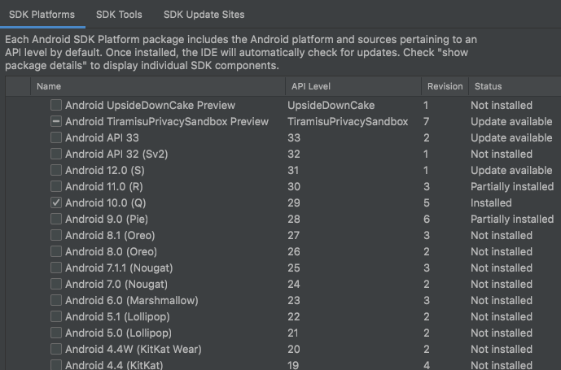
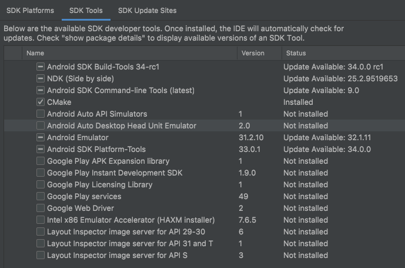
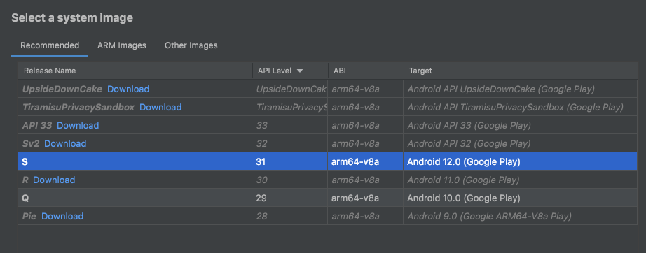

# Pokemon React Native

[](https://nodejs.org/de/blog/release/v16.13.2/)
[](https://www.npmjs.com/package/npm/v/9.3.1)
[](https://www.ruby-lang.org/en/news/2021/11/24/ruby-2-7-5-released/)
[](https://rubygems.org/gems/cocoapods/versions/1.11.3)


Este proyecto está hecho en React Native CLI. Asegúrese de haber configurado
[React Native](https://reactnative.dev/docs/environment-setup) correctamente en su máquina.

## Instalar proyecto

---

**Nota:** Si está utilizando `nvm` ejecute `nvm use`. Esto hará uso del archivo `.nvmrc`

---

npm

```sh
npm install --legacy-peer-deps
```

Yarn

```sh
yarn add
```

### Android

Luego abrir el proyecto con Android Studio e instalar los SDK necesarios




No olvide crear su emulador



### IOS

---

**Nota:** Si está utilizando `rvm` ejecute `rvm rvmrc to .ruby-version`. Esto hará uso del archivo `.rvmrc`

---

De igual manera instale los pods con `npx pod install` o `cd ios && pod install && cd ..` y abra el proyecto en Xcode
`/ios/Pokemon.xcworkspace`

Para M1: `cd ios && arch -x86_64 pod install && cd ..`

## Iniciar proyecto

- Iniciar [Metro](https://facebook.github.io/metro/) con: `npm run start`
- En otra terminal ejecutar: `npm run android` o `npm run ios`

## Ambiente de pruebas

`npm run test` u observador `npm run test:watch`

## Generar APK

Ejecute el comando `npm run generate-apk-dev`. Esto generará una apk en modo release en
`/android/app/build/outputs/apk/release/app-release.apk`

## Descargar APK

Pueden descargar el apk [release](https://github.com/TheJuanBM/PokemonApp/releases/tag/Pok%C3%A9mon)

## Contacto

Cualquier duda pueden enviar un correo a <a href = "mailto: juanpims09@gmail.com">juanpims09@gmail.com</a>
